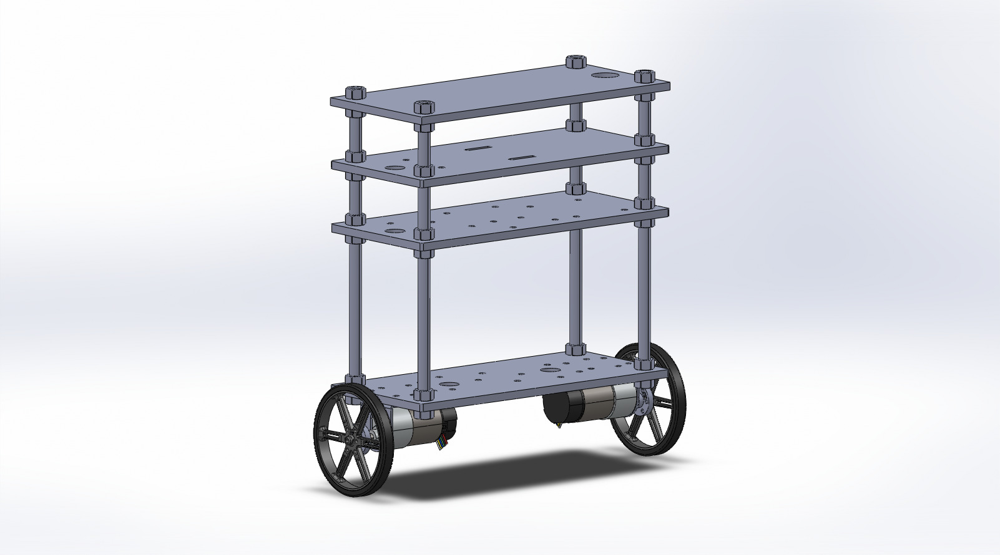

## Self Balancing Robot

## Note: This README is currently a work in progress and the project is still undergoing development.

This self-balancing robot consists of 3D-printed PLA plates, 3/8"-16 threaded rods and nuts, an Arduino Uno R3, Raspberry Pi 4 and BN0055. The motors were sourced from Pololu as well as the L-brackets to mount to the 3D-printed plates and mounting hubs.

